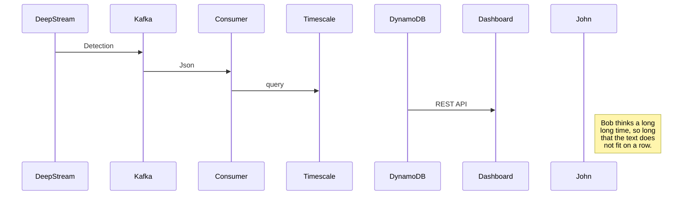
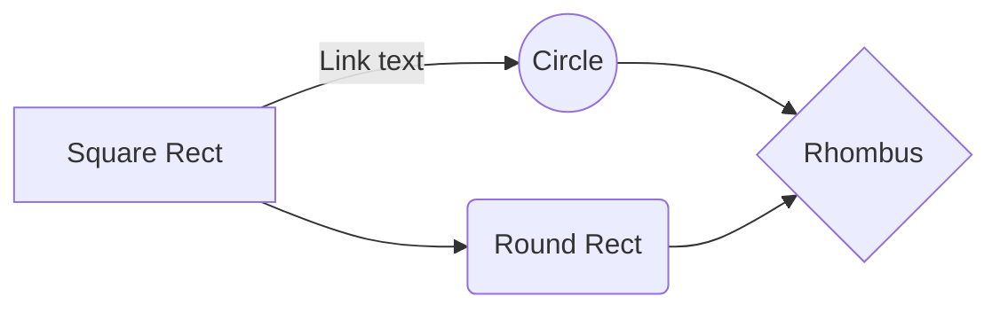

**Visual  Analytics  pipeline **
	**DeepStream****

 - DeepStream is a framework which enables Gstreamer to perform
   inferencing on live video streams. It can perform detection,
   classification and segmentation and while doing  these it can also
   record videos , save images and send notifications. The entire
   DeepStream pipeline can be configured using a couple of Config files.
  
 - Use case of DeepStream - Suhana productivity analysis 
There are 15 streams and three different detection model which are as    follows - 			YOLOv4 is used for detecting trucks, YOLOv4 is used  for    detecting workers and supervisor and YOLOv4 for detecting top    view    of    the truck .All the detection from these  	 streams is     being    converted    into events and messages using MessageConverter . This  MessageConverter plugin enables a user to create a  custom  schema.
- MessageBroker plugin - This plugin allows you to publish DeepStream    messages 	 using kafka. These messages from kafka are     consumed by three different consumers which perform special    operations on the detection and insert the result in    postgreSQL/timescale . These raw detection will be queried    periodically using custom SQL queries/command . These custom queries    will bucket the raw detections in time buckets comprising of 15secs    buckets. Now as these bucket are queried for inferring cycles which    determine the arrival and departure of trucks.

Next, you have to group departure and arrival cycles. After grouping you have to use the timings of arrivals and departure to query out the following feature.
i. Worker_count
ii. Supervisor_count
iii. Trolley_count - full_trolley_count and empty_trolley_count
iv. Idle_time - worker_count and trolley_count
After all these features have been queried the resulting data is arranged in json format which has a context or information about zones, location and client and this data is uploaded into DynamoDB so it can be displayed on dashboard.
DynamoDB is a database which is managed by AWS. Once the data arrives from DynamoDB table through Rest API frontend is mapped to the dashboard , while the data is in DynamoDB the primary key/partition key is a "Bay" and sort key is a "timestamp".

## UML diagrams

You can render UML diagrams using [Mermaid]. For example, this will produce a sequence diagram:

And this will produce a flow chart:

